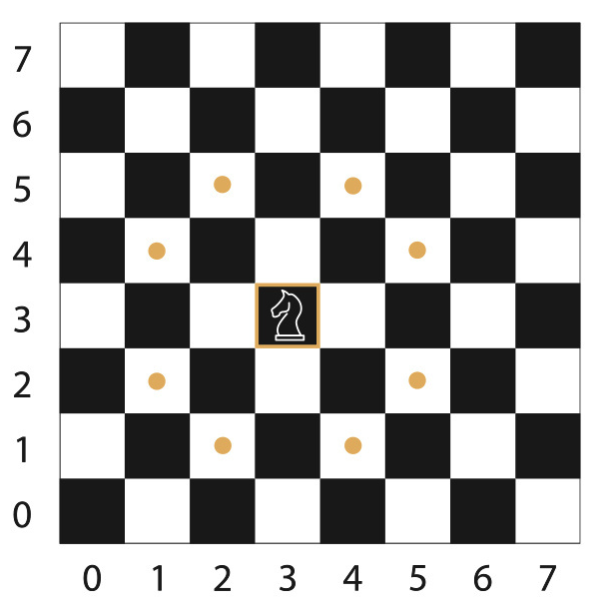
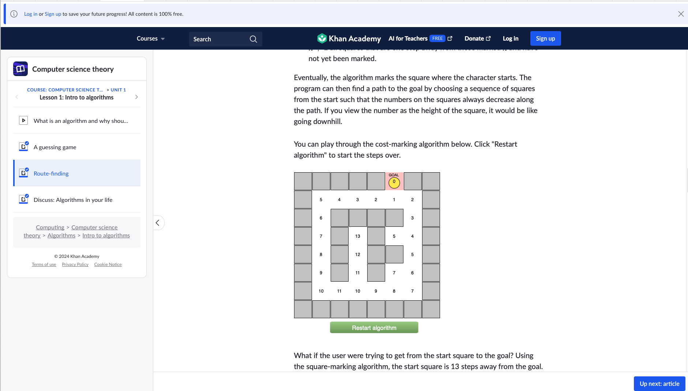

# knight_travails
Knight Travails for TOP.
The goal is to find the shortest path a Knight can take from one grid position to another on a Chess board. 
The user will put in the starting and ending coordinates and the output will be all the intermediate postions and the number of moves taken to get there. 

-------------------

I was able to solve this problem because ef Khan academy, this explanation and grid to basically give a step size and maintain a queue for a BFS algorithm helped a lot to get to the new approach. https://www.khanacademy.org/computing/computer-science/algorithms/intro-to-algorithms/a/route-finding

New Approach 
0. Properties for my defined node - the location on the board aka coordinate, the level(depth/steps) it is at wrt source coordinates and the predecessor to this node. 
1. Ask the user to provide the source and destination
2. Create a Node for this source, push this node into the queue and push the source coordinates into a visited array. The Node itself, stores the coordinates for the point, the depth/steps it sits at wrt the source and the predecessor.
3. Now as long as the queue is not empty, continue iterating on the first item in the queue.
4. For the first item in the queue, take a step size of 1 and find all the eligible places possible from this place, if any of these matches the destination, then create a new node with the coordinates as the destination coordinates, the predecessor as the current item of the queue and the step length of the current items step length+1 and send it to all_steps_taken function(which prints the number of steps taken and list of all predecessors), if not then - 
5. Out of these eligible positions possible, disregard the ones that are already in the visited array, for those that are not in the visted array, push these coordinates to the visited array because we have discovered them. Also, create nodes for all of these newly discovered coordinates, create a node for them with their coordinates, the step length of the current queue items stp length+1 and predecessor as the current queue item, and push all of these newly created nodes into the queue.
6. Now we have extracted all value from the current queue item, so we do Array.shift to get rid of the current queue item and move on to the next one. We keep doing this till either we discover the destination coordinates or we have emptied the queue

----OLD AND WRONG APPROACH-----
Step 1 - Make a chess board and define boundaries
Step 2 - Take any grid value and kill the run if it is outside the board
Step 3 - Take Every position on the grid and build an edge list for it (All the valid immediate next stop the knight can stop at)
At this point we have a master list of all steps possible. 
